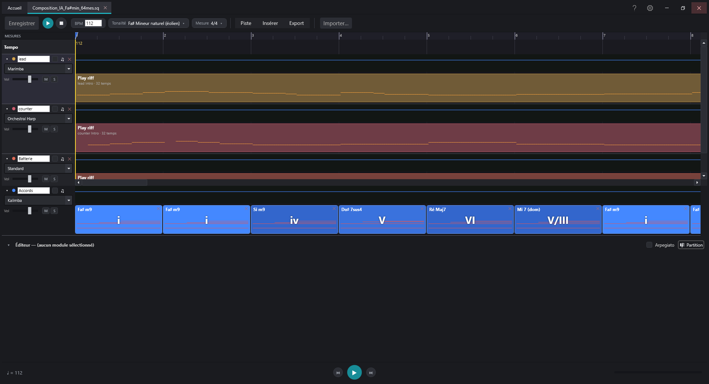
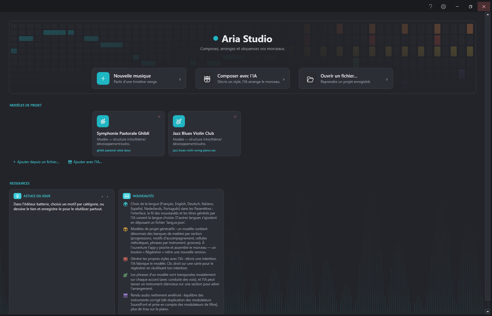
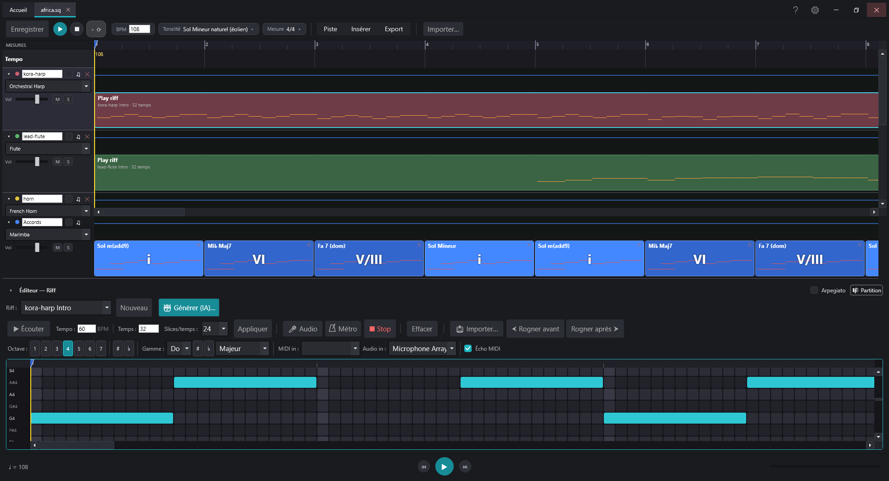
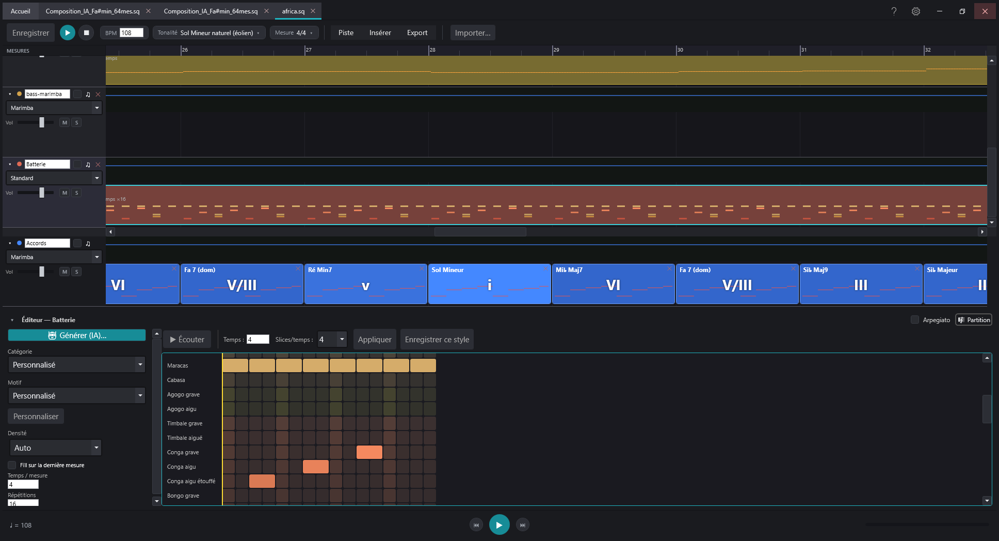
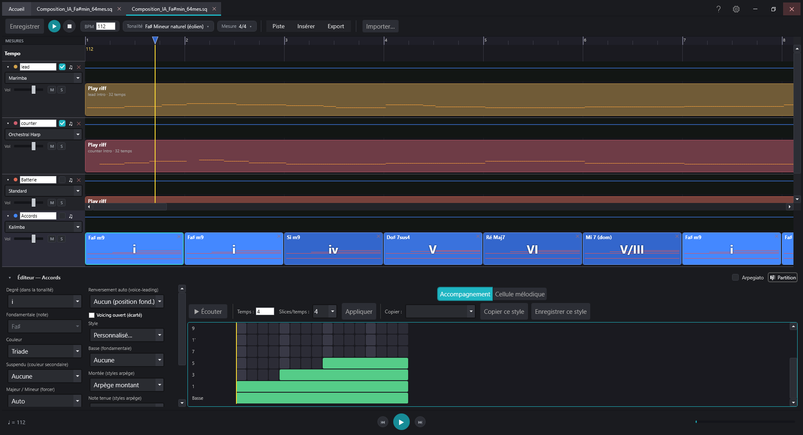
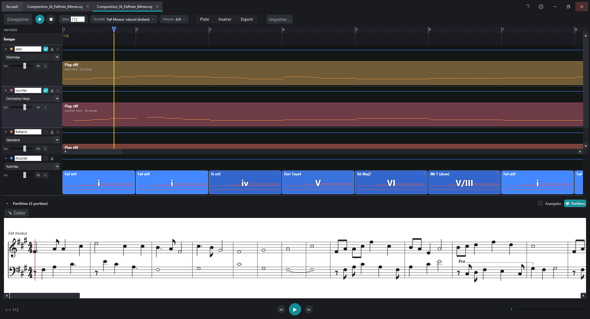
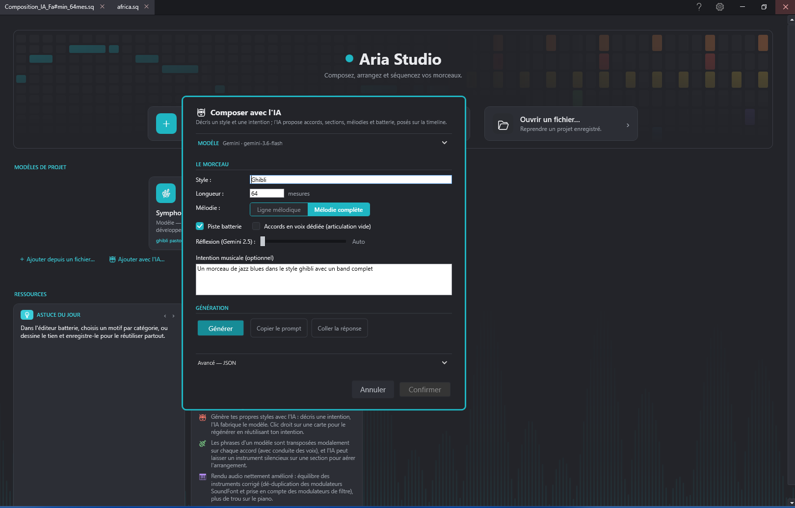

# Koton Studio

**Composez, arrangez et séquencez vos morceaux — de l'idée à la partition.**

Koton Studio réunit composition assistée par IA, éditeur d'arrangement en timeline, partition gravée et moteur audio SoundFont — dans une seule application Windows, légère et 100 % en français (8 langues au total).

&nbsp;
-informational?style=for-the-badge)
&nbsp;

*Gratuit · Aucune inscription · Installation par utilisateur (sans droits admin) · Mises à jour automatiques*

---

## Aperçu

Koton Studio est une chaîne complète de création musicale : générez une trame par IA, arrangez-la dans un séquenceur en pistes horizontales, affinez chaque partie dans des éditeurs dédiés (riff, batterie, accords, ligne mélodique), visualisez le résultat en notation gravée, écoutez-le via le moteur SoundFont, puis exportez en PDF, MuseScore, MIDI, WAV ou MP3.

---

## Fonctionnalités

| | |
|---|---|
| 🤖 **Composition par IA** | Décrivez un style et une durée : l'IA génère accords, sections, articulations, lignes mélodiques et batterie directement sur la timeline. Ajoutez aussi un instrument à un morceau existant en un clic. |
| 🔌 **Multi-fournisseurs IA** | Clients intégrés pour **Mistral, Gemini, Groq, DeepSeek, Claude, Grok et Qwen**. Enregistrez plusieurs clés nommées, ou travaillez sans clé via le presse-papiers. |
| 🎚️ **Éditeur en timeline** | Séquenceur en pistes horizontales : modules de riffs, répétitions, piste d'accords, tempo et dynamiques, règle de mesures. Copier/coller et réarranger à la volée. |
| 🎼 **Partition gravée** | Chaque piste en notation professionnelle (police Bravura), avec zoom et curseur de lecture. Export **PDF (A4)** et export **MuseScore natif (.mscx)**. |
| 🥁 **Éditeur de batterie** | Catalogue de patterns (standard, Afrique, Australie), dessin de vos grooves, génération par IA et conversion de riffs en kits de batterie. |
| 🎹 **Accords & harmonie** | Piste d'accords dédiée, générateur de cadences, suggestions de progressions, conduite des voix automatique et transposition dans n'importe quelle tonalité. |
| 🎵 **Lignes mélodiques** | Des lignes rythmiques dont le moteur choisit les hauteurs dans les accords, jusqu'aux mélodies et contre-chants entièrement écrits. |
| ⚙️ **Composition procédurale** | Moteurs 100 % algorithmiques (sériel, automate cellulaire, L-système, génétique, fractal 1/f) et styles Bach, Vivaldi, Ghibli / Hisaishi. |
| 📥 **Import & audio** | Importez **MIDI** et **MuseScore** (.mscz/.mscx) sur la timeline. Moteur audio **SoundFont (MeltySynth)**, entrée MIDI et détection de notes au micro. |
| 🌍 **Multilingue & à jour** | Interface en **8 langues**, mise à jour automatique au démarrage et signalement de bug intégré. Ajout d'une langue sans recompiler. |

---

## Captures d'écran

### Accueil

### Éditeur de riff

### Éditeur de batterie

### Éditeur d'accords

### Vue partition

### Composer avec l'IA

---

## Installation

1. Téléchargez et lancez le dernier installeur depuis la [page des releases](https://github.com/stephaneweg/MusicTracker/releases/latest).
2. L'installation se fait **pour votre compte utilisateur** — aucun droit administrateur requis.
3. Au premier lancement, Koton Studio propose de télécharger automatiquement la banque de sons de MuseScore (`.sf2`) pour activer l'audio — ou indiquez la vôtre (par ex. `MuseScore_General.sf2`).
4. Les mises à jour suivantes s'installent automatiquement au démarrage.

> **Note** — La banque de sons (`.sf2`) n'est pas incluse (plusieurs centaines de Mo) ; Koton Studio peut la télécharger au premier lancement.

**Prérequis** : Windows 10 / 11 (64 bits) · .NET Framework 4.8

---

## Exports

Koton Studio exporte vers **PDF** · **MuseScore (.mscx)** · **MIDI** · **WAV** · **MP3**.

---

## Liens

- 📥 [Télécharger la dernière version](https://github.com/stephaneweg/MusicTracker/releases/latest)
- 📋 [Toutes les versions](https://github.com/stephaneweg/MusicTracker/releases)
- 🐛 [Signaler un bug](https://github.com/stephaneweg/MusicTracker/issues)
- 📝 [Historique des versions](CHANGELOG.md)

---

Développé par **Stéphan Wegener** · © 2026 · Tous droits réservés.

